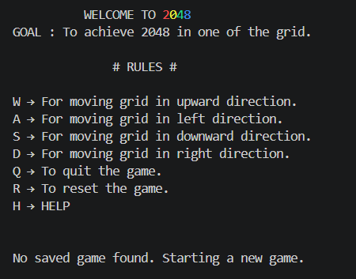
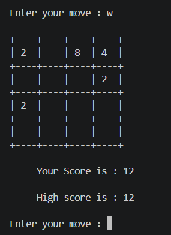
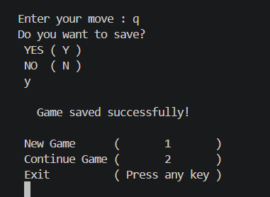

# 🎮 2048 Game in Python

A terminal-based implementation of the classic **2048** puzzle game built with **Python**. The project features modular code organization, game state persistence through save/load functionality, and an interactive command-line interface.

---

## ✨ Features

- 🎲 Classic 4×4 2048 gameplay
- ⬆️⬇️⬅️➡️ Move tiles using keyboard controls
- 🔀 Random tile generation (2 or 4)
- 🧠 Automatic tile merging and score calculation
- 💾 Save and load game progress
- 🔄 Reset game option
- ❓ Help menu with controls
- 🚫 Game-over detection

---

## 🛠️ Technologies Used

- Python 3
- File Handling (JSON)
- Modular Programming
- Object-Oriented Programming Concepts
- Command Line Interface (CLI)

---

## 📂 Project Structure

```
2048-game-python/
│
├── main.py
├── board.py
├── game_logic.py
├── file_manager.py
├── screenshots/
│   ├── menu.png
│   ├── gameplay.png
│   └── game_over.png
├── README.md
└── .gitignore
```

---

## ▶️ Getting Started

### Clone the repository

```bash
git clone https://github.com/divyansh-laddha/2048-game-python.git
```

### Navigate to the project

```bash
cd 2048-game-python
```

### Run the game

```bash
python main.py
```

---

## 🎮 Controls

| Key | Action |
|-----|--------|
| W | Move Up |
| A | Move Left |
| S | Move Down |
| D | Move Right |
| Q | Quit Game |
| R | Reset Game |
| H | Show Help |

---

## 📸 Screenshots

### Main Menu



### Gameplay



### Game Over



---

## 🚀 Future Improvements

- High score leaderboard
- Undo move functionality
- Colored terminal interface
- AI autoplay mode
- Larger board sizes (5×5, 6×6)
- Smooth animations

---

## 📖 What I Learned

While developing this project, I gained hands-on experience with:

- Python programming
- Modular software design
- File handling using JSON
- Game logic implementation
- Git and GitHub version control
- Debugging and testing

---

## 📄 License

This project is intended for educational and learning purposes.